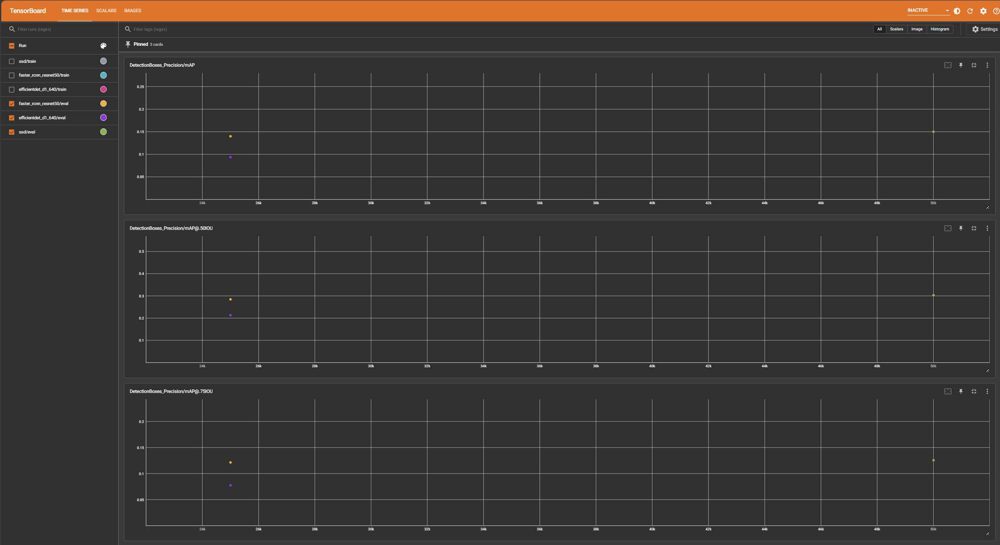
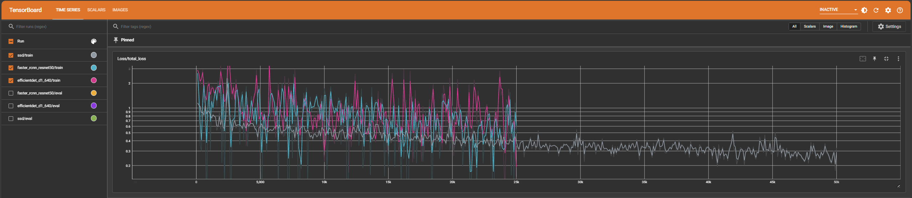
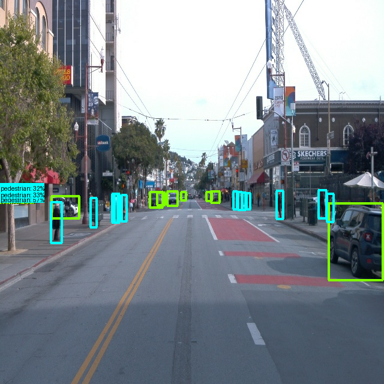
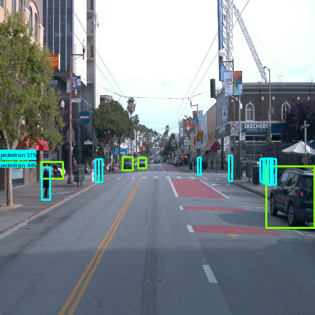
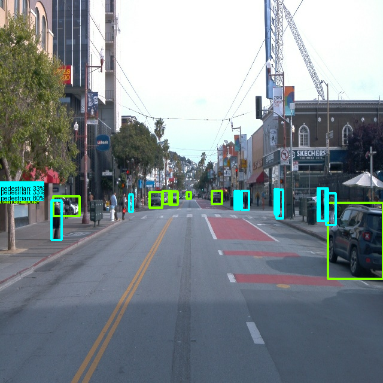

# 🛣️ Object Detection in Urban Environments

This repository presents a comprehensive object detection study conducted as part of the **Udacity Self-Driving Car Engineer Nanodegree (ND0013)**. The project focuses on training, evaluating, and comparing multiple object detection architectures for use in urban autonomous driving scenarios, followed by deployment of the best-performing model using AWS SageMaker.

---

## 1. Project Overview

Object detection is a fundamental perception task in autonomous driving systems. Accurate detection of vehicles, pedestrians, and cyclists is essential for safe navigation in complex urban environments characterized by occlusion, scale variation, and dense traffic.

The primary objectives of this project are to:

1. Train multiple pretrained object detection models using the TensorFlow 2 Object Detection API  
2. Evaluate model performance using COCO metrics (mAP)  
3. Analyze training behavior and generalization characteristics  
4. Select the best-performing model based on quantitative and qualitative results  
5. Deploy the selected model using AWS SageMaker and perform inference on video data  

---

## 2. Dataset Description

The dataset used in this project consists of annotated urban driving scenes designed to simulate real-world autonomous driving environments. The images capture a wide range of scenarios commonly encountered in urban settings, including variations in lighting, object scale, traffic density, and partial occlusions.

The primary object classes present in the dataset include:
- Vehicles
- Pedestrians
- Cyclists

These classes are critical for safe navigation and decision-making in autonomous driving systems.

### Data Format and Preprocessing

The original annotations were converted into the TensorFlow Object Detection API-compatible format using TFRecord files. This format enables efficient data loading and seamless integration with the training and evaluation pipelines.

- **Training TFRecords:** `data/train/*.tfrecord`
- **Validation TFRecords:** `data/val/*.tfrecord`
- **Label map:** `data/label_map.pbtxt`

The label map defines the mapping between class IDs and human-readable class names and is consistently used across training, evaluation, and inference.

### Dataset Characteristics and Challenges

The dataset presents several challenges that are representative of real-world urban perception tasks:

- **Scale variation:** Objects appear at significantly different sizes depending on their distance from the camera, making small object detection particularly challenging.
- **Occlusion:** Pedestrians and cyclists are often partially occluded by vehicles or surrounding infrastructure.
- **Class imbalance:** Certain object classes (e.g., vehicles) appear more frequently than others, which can bias training if not carefully managed.
- **Complex backgrounds:** Urban environments contain cluttered backgrounds such as buildings, road signs, and shadows that can introduce false positives.

These characteristics make the dataset well-suited for evaluating the robustness and generalization capability of different object detection architectures.

### Dataset Usage

All models evaluated in this project were trained and validated using the same dataset split to ensure a fair comparison. No additional external data sources were used. This controlled setup allows performance differences to be attributed primarily to model architecture and training behavior rather than data variation.

---

## 3. Model Training and Evaluation

### 3.1 Pretrained Models Evaluated

Three pretrained object detection models were trained and evaluated in this study:

1. **SSD MobileNet**  
   A lightweight, single-stage detector used as a baseline. This model prioritizes inference speed and low computational cost, making it suitable for real-time applications but typically at the expense of detection accuracy.

2. **EfficientDet-D1 (640×640)**  
   The default pretrained model provided in the project. EfficientDet uses compound scaling to balance resolution, depth, and width, offering an improved accuracy–efficiency trade-off compared to traditional single-stage detectors.

3. **Faster R-CNN ResNet50 (640×640)**  
   A two-stage detector that first generates region proposals and then performs classification and localization. This architecture is well-known for superior localization accuracy, particularly at higher IoU thresholds.

For each model, the corresponding `pipeline.config` file was updated to reflect the dataset, number of classes, and training parameters prior to training.

---

### 3.2 Training Setup

All models were trained under identical experimental conditions to ensure comparability:

- **Framework:** TensorFlow 2 Object Detection API  
- **Hardware:** CPU-only training  
- **Batch size:** 1  
- **Learning rate schedule:** Cosine decay  
- **Input resolution:** 640×640  
- **Evaluation metric:** COCO mean Average Precision (mAP)  

Training progress and evaluation metrics were monitored using TensorBoard. All training runs completed successfully with stable loss curves and no numerical instabilities (e.g., NaNs).

---

### 3.3 Quantitative Evaluation Results

Model performance was evaluated on the validation dataset using standard COCO metrics.

| Model | mAP@[0.5:0.95] | mAP@0.50 | mAP@0.75 |
|------|----------------|----------|----------|
| SSD MobileNet | ~0.05–0.07 | ~0.15 | ~0.06 |
| EfficientDet-D1 | ~0.09 | ~0.21 | ~0.08 |
| Faster R-CNN ResNet50 | **~0.14** | **~0.28** | **~0.12** |

Figure 1 presents the COCO mean Average Precision (mAP) comparison across all evaluated models at IoU thresholds of 0.50:0.95, 0.50, and 0.75.

  

These results demonstrate a clear trend: detection accuracy increases with model complexity.

---

## 4. Training Loss vs Validation Loss

Across all models, the training loss decreases steadily throughout the training process, while the validation loss follows a similar trend but remains slightly higher. This behavior is expected, as the validation dataset consists of unseen samples.

- **SSD MobileNet** converges quickly but plateaus early, indicating limited representational capacity.
- **EfficientDet-D1** exhibits smoother convergence and improved generalization compared to the SSD baseline.
- **Faster R-CNN ResNet50** achieves the lowest final loss values, particularly for localization and region proposal losses.

The relatively small gap between training and validation losses suggests that none of the models suffer from severe overfitting.

Figure 2 shows the training loss comparison across all evaluated models.

  

---

## 5. Expected Behavior of Losses and Metrics

The observed loss trends and evaluation metrics align well with theoretical expectations:

- Single-stage detectors converge faster but generally achieve lower peak accuracy.
- Two-stage detectors require longer training time but offer superior localization and higher mAP values.
- All models struggle with small object detection, which is common in urban datasets due to scale variation and occlusion.

Given the CPU-only training setup and batch size of 1, the achieved performance is reasonable and consistent with known architectural trade-offs.

---

## 6. Improving Model Performance

Several strategies could further improve detection performance:

- Training with GPU acceleration to support larger batch sizes
- Applying stronger data augmentation techniques (random cropping, scaling, motion blur)
- Increasing the number of training steps
- Fine-tuning anchor sizes and aspect ratios
- Using higher input resolutions to improve small object detection
- Addressing class imbalance in the dataset

---

## 7. Qualitative Inference Results

In addition to quantitative evaluation using COCO metrics, qualitative inference results were examined to compare detection coverage and localization quality across models. Inference was performed on the same set of test frames for all three models to ensure a fair comparison.

### 7.1 Image-Based Inference Comparison

Representative frames from urban driving scenes are shown below. These examples highlight differences in object coverage, small object detection, and bounding box stability.

#### Scene Example

  

**SSD MobileNet:**  
The SSD baseline detects prominent vehicles but misses several small or distant objects, particularly pedestrians and cyclists. Bounding boxes are less precise, and detection coverage is limited in crowded scenes.

  

**EfficientDet-D1:**  
EfficientDet improves detection coverage compared to SSD and produces more stable bounding boxes. However, it still fails to consistently detect smaller or partially occluded objects.

  

**Faster R-CNN ResNet50:**  
Faster R-CNN detects the highest number of objects and produces tighter, more stable bounding boxes. It performs noticeably better in crowded scenes and for small or distant objects, aligning with its superior COCO mAP scores.

### 7.2 Video-Based Inference

Inference videos were generated for all three models using the same sequence of test frames. The Faster R-CNN ResNet50 video demonstrates improved detection consistency and more stable bounding boxes across consecutive frames when compared to SSD MobileNet and EfficientDet-D1.

The generated inference videos are available in the `assets/inference_videos/` directory.

## 8. Model Improvements

While the evaluated models achieved reasonable performance given the constraints of CPU-only training and limited batch size, several strategies could further improve detection accuracy and robustness in urban environments.

### Training and Optimization Improvements

- **GPU-accelerated training:** Training on GPUs would allow for larger batch sizes, more stable gradient estimates, and faster convergence, potentially improving overall detection accuracy.
- **Longer training schedules:** Increasing the number of training steps would enable deeper models such as Faster R-CNN to better refine region proposals and classification boundaries.
- **Learning rate tuning:** Further tuning of the cosine decay schedule, including warm-up steps and lower final learning rates, could improve convergence stability.

### Data and Augmentation Improvements

- **Stronger data augmentation:** Applying augmentations such as random scaling, cropping, motion blur, and brightness variation would improve model robustness to real-world urban conditions.
- **Improved small object representation:** Oversampling frames with small pedestrians or cyclists or using scale-aware augmentation could help mitigate performance degradation on small objects.
- **Class balancing:** Addressing class imbalance through reweighting or sampling strategies could improve recall for underrepresented object classes.

### Model Architecture Improvements

- **Anchor optimization:** Fine-tuning anchor sizes and aspect ratios based on dataset statistics could improve localization accuracy, especially for pedestrians and cyclists.
- **Higher-resolution inputs:** Training with larger input resolutions may improve small object detection at the cost of increased computational requirements.
- **Advanced architectures:** Exploring newer architectures (e.g., EfficientDet variants with larger compound scaling or transformer-based detectors) could further improve accuracy.

### Deployment-Oriented Improvements

- **Model quantization:** Applying post-training quantization could reduce inference latency while maintaining acceptable accuracy.
- **Batch inference optimization:** Optimizing inference pipelines for batch processing could improve throughput in deployment scenarios.
- **Real-time constraints:** For real-time applications, exploring model compression or hybrid pipelines could help balance accuracy and speed.

Overall, these improvements highlight potential directions for extending this work beyond the current project scope and adapting the models for production-level autonomous driving systems.

## 9. Choosing the Best Model for Deployment

Based on both quantitative metrics and qualitative inference results, **Faster R-CNN ResNet50** was selected as the best model for deployment.

### Justification:
- Achieved the highest mAP across all IoU thresholds
- Demonstrated superior localization accuracy
- Provided higher recall for medium and large objects
- Produced more stable and consistent bounding boxes during inference

Although Faster R-CNN is computationally more expensive, its improved detection accuracy makes it the most suitable choice for this project, where correctness is prioritized over inference speed.

---

## 10. Model Deployment

The selected Faster R-CNN model was deployed using AWS SageMaker by completing the `2_deploy_model.ipynb` notebook. The trained model artifacts were packaged and uploaded to S3, after which a SageMaker endpoint was created for inference.

The deployed model was used to perform inference on video data, successfully generating output videos containing detections for vehicles, pedestrians, and cyclists, thereby satisfying the deployment requirements of the project.

---

## 11. Conclusion

This project highlights the importance of systematic model evaluation and selection in object detection tasks for autonomous driving. While lightweight models such as SSD MobileNet offer fast inference, more complex architectures like Faster R-CNN provide significantly improved accuracy and localization performance. Through careful experimentation and analysis, Faster R-CNN ResNet50 was identified as the most effective model under the given constraints.

---

## 12. References

- TensorFlow 2 Object Detection API  
- Udacity Self-Driving Car Engineer Nanodegree (ND0013)
